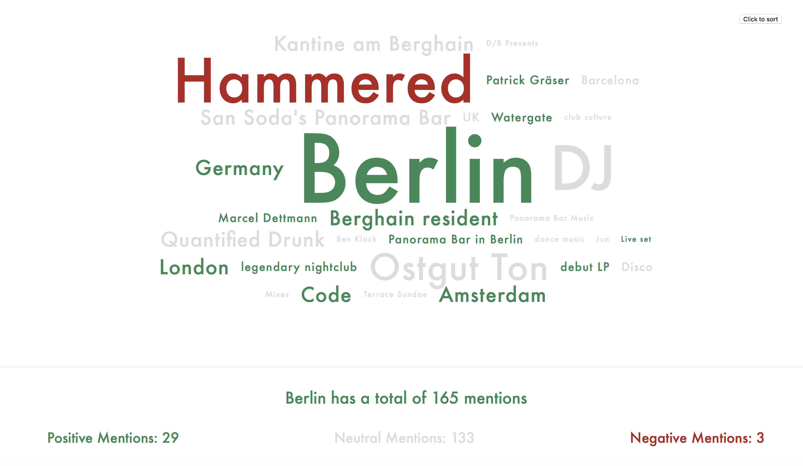

 
To run the project locally a local web server is required

Therefore an option is to install it via npm, like so:

npm i local-web-server

And then inside the project folder call ws, like so:

$ ws  
Serving at http://mbp.local:8000, http://127.0.0.1:8000, http://192.168.0.100:8000

By doing so the following errors are avoided:

[Error] Origin null is not allowed by Access-Control-Allow-Origin.  
[Error] Failed to load resource: Origin null is not allowed by Access-Control-Allow-Origin.  
[Error] TypeError: Cross-origin script load denied by Cross-Origin Resource Sharing policy.  

Otherwise, change the local JSON file for one remote such as 'https://api.myjson.com/bins/1ge1ld'

Like so:  

From this:  
...  
const data = oboe('data/topics.json')  
...  

To this:  
...  
const data = oboe('https://api.myjson.com/bins/1ge1ld')  
...  
